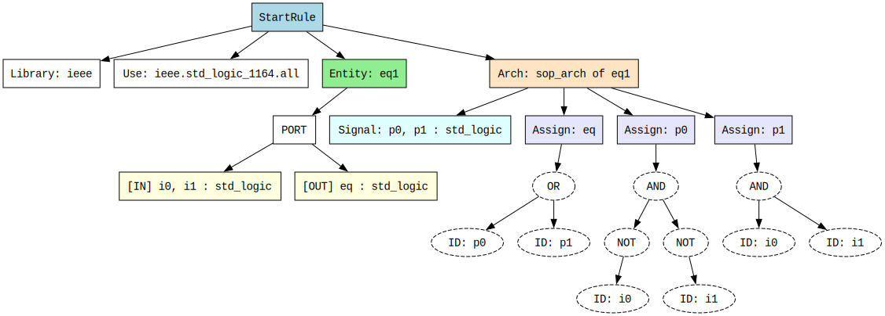

# vhdl-compiler

Minimal ANTLRv4 + C++ compiler project structure using bash.

## Prerequisites

- Bash
- C++17 compiler
- Java Runtime (for ANTLR code generation)
- antlr4-runtime
- git
- curl
- Graphviz

## Build

```bash
./compile.sh
```

## Run

```bash
./build/vhdl_compiler ./tests/fixtures/hello_word.vhd p0=1 p1=0 i0=0 i1=0
```

## Example output
Output:
eq = 1
p0 = 1
p1 = 0

# Run for the ast
```bash
./build/vhdl_parser ./tests/fixtures/hello_word.vhd > tree.dot
dot -Tsvg tree.dot -o tree.svg
brave tree.svg
```
### Example output



# Protokoll
Diese Aufgabe umfasste die Implementierung der statischen Semantikprüfung sowie eines Interpreters für das VHDL-Subset. Im Vergleich zur vorherigen Aufgabe (AST-Aufbau) war der Einstieg deutlich einfacher, da der AST bereits als vollständig typisierte Klassenstruktur vorlag. Beide Phasen: Semantikprüfer und Interpreter, traversieren lediglich diesen bestehenden AST, ohne erneut mit ANTLR oder dem Parse-Tree interagieren zu müssen.

### 3b Statische Semantik
#### Regeln
Es wurden zwei semantische Regeln implementiert:

- Regel 1: Architecture referenziert eine bekannte Entity: Jede Architecture benennt im Kopf eine Entity. Es wird geprüft, ob eine Entity mit diesem Namen im AST existiert. Ist das nicht der Fall, handelt es sich um einen semantischen Fehler.
- Regel 2: Nur definierte Variablen verwenden: In jedem Statement wird die linke Seite (Ziel der Zuweisung) sowie alle Variablen im Ausdruck (rechte Seite) gegen den gültigen Scope geprüft. Der Scope besteht aus den Signalen der Architecture und den Port-Signalen der zugehörigen Entity.

#### Architektur des SemanticChecker
Der SemanticChecker ist eine eigenständige Klasse, die den fertigen AST als Eingabe erhält. Er hält intern eine Liste von Fehlermeldungen:
std::vector<std::string> errors;

Die öffentliche Schnittstelle besteht aus einer einzigen Methode:
bool check(const StartRule& root);

Sie gibt true zurück wenn keine Fehler gefunden wurden, sonst false. Intern gliedert sich die Prüfung in zwei private Methoden:
- checkArchitectureEntities(root) prüft Regel 1
- checkArchitectureSignals(arch, entity*) prüft Regel 2 für eine konkrete Architecture

#### Ablauf
1. Alle Entity-Namen werden in ein std::unordered_set eingetragen.
2. Für jede Architecture wird geprüft ob arch.entity im Set vorhanden ist (Regel 1).
3. Der Scope für Regel 2 wird aufgebaut: Signal-Namen der Architecture + Port-Namen der zugehörigen Entity.
4. Für jedes Statement wird die linke Seite und der Ausdruck gegen den Scope geprüft.
5. Ausdrücke werden rekursiv traversiert, dieselbe ExprNode-Hierarchie wie beim Interpreter, und jeder IdExpr-Knoten wird gegen den Scope validiert.
6. Alle gefundenen Fehler werden gesammelt und nach dem vollständigen Durchlauf auf stderr ausgegeben.

### 3b. Dynamische Semantik — Interpreter
#### Konzept
Da das VHDL-Subset ausschließlich kombinatorische Logik beschreibt (AND, OR, NOT auf booleschen Signalen, keine Schleifen, kein State), eignet sich ein Interpreter deutlich besser als ein Compiler. Der Interpreter traversiert den AST direkt und wertet ihn mit konkreten Eingabewerten aus, ohne Zwischencode zu erzeugen. Dieses Vorgehen entspricht dem Prinzip echter VHDL-Simulatoren.

#### Architektur der Interpreter-Klasse
Der Interpreter hält eine einzige interne Datenstruktur, die Umgebung (env):
std::unordered_map<std::string, bool> env;

Sie bildet Variablennamen auf boolesche Werte ab und dient als zentraler Zustand während der Auswertung. Die öffentliche Schnittstelle besteht aus zwei Methoden:
    • filloutArgs(argc, argv) liest die Port-Belegungen von der Kommandozeile ein und befüllt env
    • output(root) wertet alle Statements aus und gibt die Ergebnisse aus

Die private Methode evalExpr(node) übernimmt die rekursive Auswertung der Ausdruckshierarchie.

#### Ablauf
1. filloutArgs parst Argumente der Form a=1 oder b=0 ab argv[2]. Der String wird bei '=' aufgeteilt, der Wert zu bool konvertiert und unter dem Namen in env eingetragen. Ungültige Werte oder fehlende '=' werden als Fehler zurückgegeben.

2. output iteriert über alle Architectures und deren Statements. Für jedes Statement wird evalExpr auf dem Ausdrucksbaum aufgerufen.

3. evalExpr wertet den ExprNode-Baum rekursiv aus:
    • IdExpr → env.at(name) — Nachschlagen des Wertes in der Umgebung
    • NotExpr → !evalExpr(operand)
    • AndExpr → Short-circuit AND über alle Operanden
    • OrExpr → Short-circuit OR über alle Operanden

4. Das Ergebnis jedes Statements wird zusammen mit dem Zielnamen auf stdout ausgegeben:
y = 1

